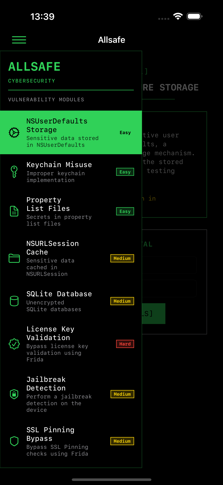
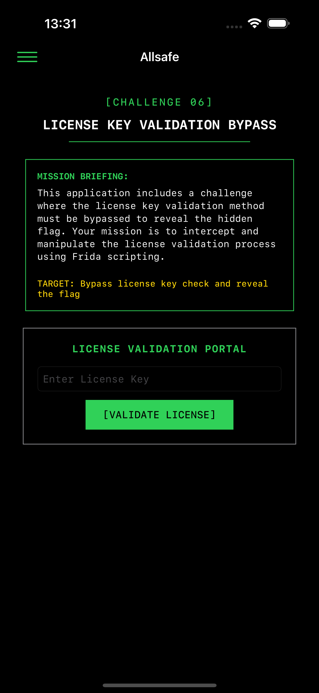

<div align="center">
  
  
  # Allsafe
  
  **An Intentionally Vulnerable iOS Application for Security Education**
  
  [](https://www.gnu.org/licenses/gpl-3.0)
  
  
  
  <p align="center">
    <a href="#features">Features</a> •
    <a href="#screenshots">Screenshots</a> •
    <a href="#installation">Installation</a> •
    <a href="#challenges">Challenges</a> •
    <a href="#contributing">Contributing</a> •
    <a href="#support">Support</a>
  </p>
</div>

---

## 📱 About

**Allsafe** is an intentionally vulnerable iOS application designed for security enthusiasts, pentesters, and developers to learn about Android application security. Unlike typical CTF-style apps, Allsafe simulates a real-world application using modern libraries and technologies, providing a practical learning experience for identifying and exploiting iOS vulnerabilities.

### 🎯 Key Features

- **15+ Security Challenges** covering various vulnerability categories
- **Swift + UIKit** stack with modular structure
- **Frida Challenges** for dynamic instrumentation practice
- **Real-world Scenarios** that mirror actual application vulnerabilities
- **Progressive Difficulty** from beginner to advanced levels
- **Clean UI/UX** with a hacker-themed terminal interface

## 📸 Screenshots

<div align="center">
  
  
  
</div>

## 🚀 Installation

### Prerequisites

- Physical iOS device with iOS 16.1.1 or later
- (Optional) Frida for dynamic analysis challenges

### Download & Install

#### Download IPA from the realeses

```bash
# Download the latest APK from releases
wget https://github.com/t0thkr1s/allsafe-ios/releases/latest/download/allsafe-ios.ipa
```

## 🎮 Challenges

The application contains various security challenges organized by difficulty

Contributions are welcome! Whether you've found a bug, have a suggestion, or want to add a new challenge:

1. Fork the repository
2. Create your feature branch (`git checkout -b feature/AmazingFeature`)
3. Commit your changes (`git commit -m 'Add some AmazingFeature'`)
4. Push to the branch (`git push origin feature/AmazingFeature`)
5. Open a Pull Request

## 💖 Support

If you found this project helpful or valuable, please consider:

- ⭐ Giving it a star on GitHub
- 🐛 Reporting bugs or suggesting improvements
- 💰 Supporting through cryptocurrency donations:

**Bitcoin (BTC)**  
`bc1qd44kvj6zatjgn27n45uxd3nprzt6rm9x9g2yc8`

**Ethereum (ETH)**  
`0x1835a58E866a668C48Ee63d32432C7Fe28aF54b4`

## 📚 Learning Resources

- [OWASP Mobile Security Testing Guide](https://owasp.org/www-project-mobile-security-testing-guide/)
- [Frida Documentation](https://frida.re/docs/home/)

## ⚠️ Disclaimer

This application is designed for **educational purposes only**. It should only be used in controlled environments where you have explicit permission. The developers assume no liability and are not responsible for any misuse or damage caused by this application.

**Do not use this application:**
- On devices you don't own
- In production environments
- For illegal purposes
- Without proper authorization

## 📄 License

This project is licensed under the GNU General Public License v3.0 - see the [LICENSE](LICENSE) file for details.

---

<div align="center">
  <sub>Built with ❤️ for the security community</sub>
  <br>
  <sub>Happy Hacking! 🚀</sub>
</div>
